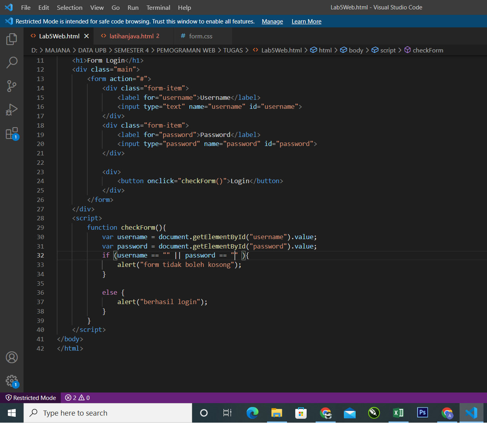

# Lab5Web

## Hasil Praktikum 5

- Script Form login di HTML dan CSS

- Hasil pembuatan Form

- Merubah tampilan login dengan form.css supaya lebih menarik

- Hasil dan perubahan

- Script Javascript untuk menu login

- Hasil dan Perubahan Form tidak boleh kosong tanpa mengisi data pada form

- Hasil dan Perubahan Form tidak boleh kosong hanya mengisi data pada form username

- Hasil dan Perubahan berhasil login

